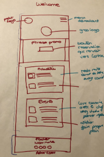
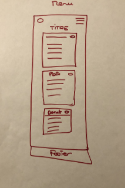
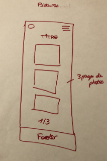
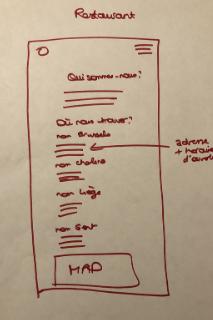
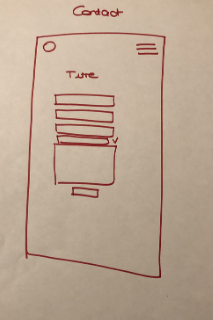

# restaurant-css-framework

### Objectif du projet :

Créer le site responsive d'un restaurant franchisé fictif à l'aide de Bootstrap. 

**[Le Résultat ici](https://rohmerpauline.github.io/restaurant-css-framework/)**

### Consignes :

Les consignes : Créer 5 pages welcome, menu, pictures, restaurants et contact.

**Welcome** : une page avec un *Jumbotron* et deux paneaux contenant les actualités du restaurant (promo, événements).

**Menu** : la page Menu avec le menu du restaurant sous form de listes avec badges.

**Pictures** : une page avec une galerie de 10 photos minimum avec une pagination (3 photos par page)

**Restaurant** : une page sur les différents restaurants de la franchise avec leurs adresses, une carte et les différents horaires.

**Contact** : une page avec un formulaire de contact (prénom, nom, email, sujet du message à l'aide d'une drop-down list, un espace de texte libre et un bouton Envoyer avec une icône).

### Mon organisation sur le projet :

Le projet devait être réalisé en 4 jours. 

**Mon planning** : 

Premier jour : 
- 1/2 journée : planification du site, réalisation des schémas, recherche d'inspiration.
- 1/2 journée : rédaction du contenu, du logo et début du fichier HTML

Deuxième jour : 
- 1/2 journée : fin du fichier HTML, style du Header/Footer et de la page Welcome
- 1/2 journée : style de la page Pictures et Restaurant

Troisième jour : 
- 1/2 journée : style de la page Contacts
- 1/2 journée : retouches sur les pages

Quatrième jour : 
- relecture, dernières modifications et réalisation du README

**Mes schémas** /!\ Artiste en devenir

 
 

**Mon brief** : [Chez Mauricette brief](https://github.com/rohmerpauline/restaurant-css-framework/blob/main/Chez%20Mauricette%20-%20brief.pdf)

### Projet réalisé en solo : 

Pauline Rohmer

Projet réalisé dans le cadre de la formation développeur web chez [BeCode](https://becode.org/)

## Copyrights :

Images [Unsplash](https://unsplash.com)

* Photo by [Clem Onojeghuo](https://unsplash.com/@clemono?utm_source=unsplash&utm_medium=referral&utm_content=creditCopyText) on Unsplash
* Photo by [Dana DeVolk](https://unsplash.com/@thissillygirlskitchen?utm_source=unsplash&utm_medium=referral&utm_content=creditCopyText) on Unsplash
* Photo by [Pel](https://unsplash.com/@cha_pel?utm_source=unsplash&utm_medium=referral&utm_content=creditCopyText) on Unsplash
* Photo by [Jack Michaud](https://unsplash.com/@jackmichaud?utm_source=unsplash&utm_medium=referral&utm_content=creditCopyText) on Unsplash
* Photo by [Patrick Schneider](https://unsplash.com/@patrick_schneider?utm_source=unsplash&utm_medium=referral&utm_content=creditCopyText) on Unsplash
* Photo by [Jo Sonn](https://unsplash.com/@foodreich?utm_source=unsplash&utm_medium=referral&utm_content=creditCopyText) on Unsplash
* Photo by [Emiliano Vittoriosi](https://unsplash.com/photos/OFismyezPnY) on Unsplash
* Photo by [CHUTTERSNAP](https://unsplash.com/@chuttersnap?utm_source=unsplash&utm_medium=referral&utm_content=creditCopyText) on Unsplash
* Photo by [Siyuan](https://unsplash.com/@jsycra?utm_source=unsplash&utm_medium=referral&utm_content=creditCopyText) on Unsplash
* Photo by [Dilyara Garifullina](https://unsplash.com/@dilja96?utm_source=unsplash&utm_medium=referral&utm_content=creditCopyText) on Unsplash
* Photo by [Jennifer Schmidt](https://unsplash.com/@jsfoodphotography?utm_source=unsplash&utm_medium=referral&utm_content=creditCopyText) on Unsplash
* Photo by [Melissa Walker Horn](https://unsplash.com/@sugercoatit?utm_source=unsplash&utm_medium=referral&utm_content=creditCopyText) on Unsplash
* Photo by [Alex Harvey](https://unsplash.com/@alexharvey?utm_source=unsplash&utm_medium=referral&utm_content=creditCopyText) on Unsplash

Logo réalisé sur [Canva](https://canva.com)